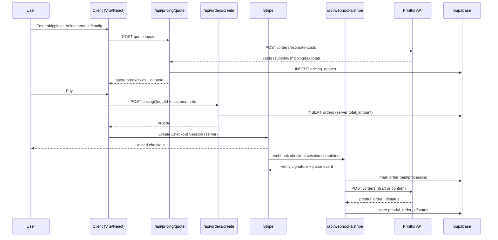
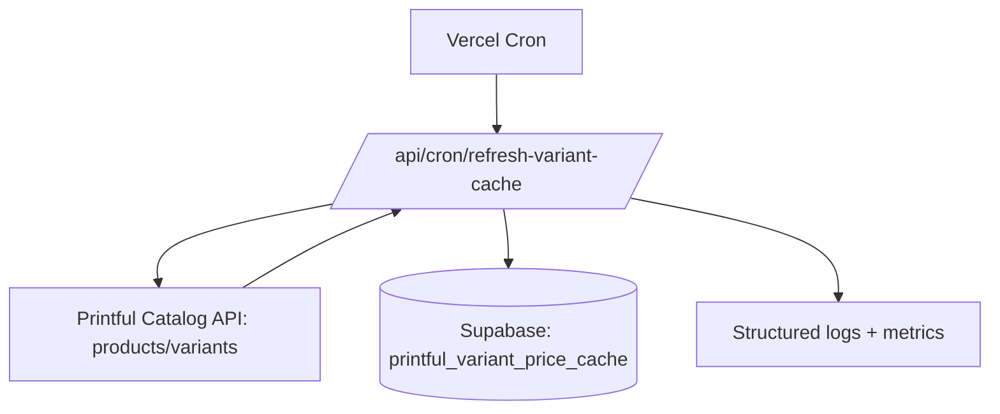

# Cursor Agent Prompt: Printful Pricing System for Golden Goose Tees

## Executive summary

You will implement a production-grade, Printful-backed pricing system that is accurate (uses Printful cost estimation), competitive (category-specific targets + psychological rounding), and secure (server-authoritative totals; Stripe webhook signature verification; server-side Printful fulfillment). Your implementation must treat **Printful costs as COGS**, not retail, and must stop relying on hardcoded placeholder pricing and flat shipping in the client. fileciteturn96file0L1-L1 fileciteturn81file0L1-L1

Core design:

- **Catalog browsing**: show “starting at” prices computed from a **cached min-variant Printful base cost** + pricing formula (fast; low API usage).
- **Checkout quoting**: compute a final, authoritative quote using **Printful cost estimation** (`POST /orders/estimate-costs`) including item costs, print extras, shipping, and taxes; then solve for the retail total that hits profit targets after Stripe fees + refund buffer. citeturn3search1
- **Order creation**: server endpoint persists a **pricing snapshot** (Printful estimate + fees + the exact parameters used) and sets `orders.total_amount`. No client-controlled amount should be chargeable. (Right now, Stripe Checkout re-fetches the order total from Supabase, which is good, but only if the DB total is not user-spoofable. Keep this pattern and strengthen it.) fileciteturn73file0L1-L1
- **Payments**: fix the PaymentIntent path so it also **re-resolves** amounts from Supabase instead of trusting client-provided cents. fileciteturn86file0L1-L1
- **Fulfillment**: move Printful submission to server (Stripe webhook) and implement real Stripe **signature verification using raw body** (currently bypassed). fileciteturn74file0L1-L1 citeturn0search4turn0search0
- **Cron caching**: add a scheduled job to refresh variant pricing for a curated product set, respecting Printful rate limits and avoiding shipping-rate caching (Printful explicitly warns against caching dynamic rates). citeturn0search1turn2search10

Scope note: the repo already contains Printful “catalog list” and “catalog product detail” endpoints, but list pricing is a placeholder ($19.99). Replace it with cached pricing. fileciteturn96file0L1-L1

## Info needs

Before coding, you must confirm/learn these specifics (and document the answers inline in PR descriptions):

- How the **design record** (in Supabase) stores: `variant_id`, `product_id`, print file URLs, placement mapping (front/back/etc), and quantity assumptions—so you can build correct Printful `items[].files` payloads for estimates and real orders. (You must cite the exact repo files you read for this.)
- Which Supabase tables/columns currently exist and what **RLS** is enabled for public inserts/updates in `orders` and `designs`, to ensure “server-authoritative totals” aren’t bypassable.
- Exact Printful API mode used (OAuth vs private token) and store configuration (shipping settings/markup) because Printful warns `/shipping/rates` vs `/orders/estimate-costs` may differ if store shipping settings are configured. citeturn0search1turn3search1
- The set of “launch SKUs” and their Printful identifiers (product IDs + variant IDs) plus which print techniques are needed (DTG vs embroidery), because Printful base price includes **one placement**, and extras add cost. citeturn2search5turn2search6
- Stripe mode: confirm whether you will support both payment paths; if yes, ensure both are equally secure and server-driven. Stripe’s webhook signing requires **raw body**. citeturn0search4turn0search0
- Your initial pricing parameters (profit targets, margin floors, buffers). If anything is unspecified, use the defaults in this prompt (document them as assumptions).

## Product and shipping decisions

### Product selection decision

Do **not** offer the entire Printful catalog initially. Offer a curated set of high-demand, lower-support SKUs across apparel + headwear + drinkware + wall art, with an architecture that makes expanding easy by adding items to a single config list.

Reasons:

- Catalog-wide pricing cache would be large and costly to maintain; Printful endpoints are rate limited (example: default 120 requests / 60 seconds with lockout after exceeding). citeturn0search1turn2search10
- Many categories (mugs, hats, posters, etc.) frequently ship separately, increasing split shipments and shipping-cost complexity; your system can handle it with estimates, but support burden rises if you launch everything at once. citeturn0search3turn3search10
- Printful pricing includes one placement; extras vary by product/technique. Engineering + UX complexity increases sharply across the full catalog. citeturn2search5turn2search6

**Launch offer set (final decision):**

Apparel:
- Unisex staple tee (primary “hero” tee) using **entity["company","Bella+Canvas","apparel brand"]** (Printful identifies 3001 as its most popular Bella+Canvas tee). citeturn4search7
- Budget/value tee using **entity["company","Gildan","apparel brand"]** (Printful identifies 64000 as its most popular Gildan tee). citeturn4search3
- Crewneck sweatshirt + hoodie (two warmth tiers). Hoodies/sweatshirts remain consistently popular and can justify higher prices, especially with embroidery. citeturn4search0turn4search14turn4search1

Headwear:
- Dad cap + trucker cap + beanie (embroidered). Hats are a top embroidery category with broad demand. citeturn4search0turn4search14turn4news47

Drinkware:
- Classic 11 oz ceramic mug (optionally plus enamel mug later). Mugs are evergreen and giftable. citeturn4search14turn4news47

Wall art:
- Unframed poster (one size to start, expand later). Wall art is a known conversion category, but shipping/split shipments require correct estimation. citeturn4news47turn0search3

Everything else (keychains, phone cases, stickers, etc.): **defer** until pricing, quoting, and fulfillment are rock-solid and you have a support workflow. The code should support expansion by adding offerings, not by rewriting pricing logic.

image_group{"layout":"carousel","aspect_ratio":"16:9","query":["Printful unisex staple tee Bella Canvas 3001 mockup","embroidered dad hat print on demand","custom ceramic mug print on demand","print on demand poster wall art"],"num_per_query":1}

### Shipping strategy decision

Use **dynamic shipping at checkout** (quote-time) based on Printful estimates, with a flat-rate fallback only for outages.

Justification:

- Printful explicitly states shipping-rate endpoints are meant to be called **right before placing an order** and warns dynamic rates can change quickly; caching can cause mismatches and dissatisfaction. citeturn0search1turn2search0
- Printful provides a downloadable CSV of flat rates as an option to reduce shipping-rate volume; treat this as a fallback, not the primary source of truth. citeturn0search1turn2search10
- Printful’s cost estimation endpoint returns shipping and taxes for the order estimate; use it to compute authoritative totals (and avoid Printful’s deprecated standalone tax endpoint). citeturn3search1turn0search1

Implementation rule:
- Before address is known: show “Estimated shipping” (UX copy) or a conservative default, but do **not** hardcode into the final total. (Current hardcoded $5.99 must be removed from authoritative pricing.) fileciteturn81file0L1-L1
- Once address is known: compute shipping via Printful estimate (and/or optionally list methods via `/shipping/rates`).

## Pricing model and data model

### Pricing formula and cost stack

You must compute two things:

- **Printful_total_cost**: what you’ll pay Printful for the order (COGS), including item+print extras, shipping, and Printful-charged taxes, using `POST /orders/estimate-costs`. citeturn3search1
- **Retail_total**: what you charge the customer so you hit profit targets after Stripe fees and buffers. Stripe’s headline fee: **2.9% + $0.30** per successful domestic card transaction (US pricing page). citeturn1search0

Definitions (USD, unless otherwise configured):

- `C` = Printful_total_cost (from estimate: subtotal + shipping + tax/vat)
- `p_stripe` = 0.029 (default)
- `f_stripe` = 0.30 (default)
- `p_refund_buffer` = 0.02 (default; covers refunds/reships/variance)
- `P_target` = category profit target in USD (defaults below)
- `margin_floor` = minimum gross margin on retail subtotal (default 0.30; enforced)

Solve for retail total `R`:

`R = (C + P_target + f_stripe) / (1 - p_stripe - p_refund_buffer)`

Then apply rounding (psychological pricing):
- For apparel/headwear: round **up** to end in `.99`
- For drinkware/wall art: round **up** to end in `.95` or `.99` (choose one and be consistent)

Margin sanity check:
- Estimate gross margin: `(R - C - stripe_fee_est - refund_buffer_est) / R`
- If below `margin_floor`, increase `P_target` (or apply multiplier) until floor is met.

Default parameter assumptions (document as configurable constants):
- `profit_target_usd`:
  - tees: **$4**
  - hoodies/sweatshirts: **$8**
  - hats: **$5**
  - mugs: **$5**
  - posters: **$7**
- `p_refund_buffer`: **2%**
- `margin_floor`: **30%**

Printful pricing context:
- Printful base price includes the blank + *one* print/embroidery placement; extra placements and features add cost. citeturn2search5turn2search6

Tax handling constraint:
- Don’t use Printful’s deprecated `/tax/rates` for production logic. Printful notes it’s sunset/removed and advises estimates/order creation for totals. citeturn0search1turn3search1

### Required pricing artifacts to persist

You must persist a **pricing snapshot** per order so you can:
- reproduce why a user was charged what they were charged,
- reconcile Printful invoices vs Stripe receipts,
- handle refunds/partials cleanly,
- update future pricing logic without mutating past orders.

Persist these for every order:

- `pricing_version` (string, e.g. `v1.0.0`)
- `currency` (e.g. `USD`)
- `quote_input` (JSON): variant_id, product_id, configuration_id, quantity, recipient country/state/zip (as provided), shipping_method chosen, and a hash of print file URLs
- `printful_estimate` (JSON): full response from `POST /orders/estimate-costs` (or at least costs breakdown: Printful subtotal/shipping/tax/total)
- `pricing_math` (JSON): p_stripe, f_stripe, refund_buffer_pct, P_target, margin_floor, raw solved retail total, rounded retail total
- `retail_breakdown` (numeric fields, duplicated from pricing_math for easy querying/reporting):
  - `retail_total_amount`
  - `retail_subtotal_amount` (if you split it)
  - `retail_shipping_amount` (if you split it)
  - `retail_tax_amount` (if you split it)
  - `stripe_fee_est_amount`
  - `refund_buffer_est_amount`
  - `profit_target_amount`
  - `profit_est_amount` (computed)

### DB schema changes and migrations

You must implement SQL migrations (Postgres / Supabase). If the repo does not currently contain a migrations folder, create `supabase/migrations/` and place timestamped SQL there.

**Migration 1: variant pricing cache + quotes + richer order pricing fields**

```sql
-- 001_pricing_system.sql

-- Cache of Printful variant base prices for fast catalog rendering
create table if not exists printful_variant_price_cache (
  variant_id bigint primary key,
  product_id bigint null,
  currency text not null default 'USD',
  printful_base_price numeric(10,2) not null, -- base w/ 1 placement baked in, per Printful catalog/variant price
  availability_status text null,
  updated_at timestamptz not null default now()
);

create index if not exists idx_printful_variant_price_cache_product
  on printful_variant_price_cache(product_id);

-- Ephemeral quotes (authoritative totals at time of checkout)
create table if not exists pricing_quotes (
  id uuid primary key,
  pricing_version text not null,
  currency text not null default 'USD',
  design_id uuid null,
  variant_id bigint not null,
  configuration_id text null,
  quantity int not null default 1,
  shipping_method text not null default 'STANDARD',
  recipient jsonb not null, -- country/state/zip/etc
  quote_input_hash text not null,

  printful_estimate jsonb not null,
  printful_total_cost numeric(10,2) not null,

  retail_total_amount numeric(10,2) not null,
  stripe_fee_est_amount numeric(10,2) not null,
  refund_buffer_est_amount numeric(10,2) not null,
  profit_target_amount numeric(10,2) not null,
  profit_est_amount numeric(10,2) not null,

  created_at timestamptz not null default now(),
  expires_at timestamptz not null
);

create index if not exists idx_pricing_quotes_expires_at
  on pricing_quotes(expires_at);

-- Orders: add pricing snapshot fields
alter table orders
  add column if not exists pricing_quote_id uuid null references pricing_quotes(id),
  add column if not exists pricing_version text null,
  add column if not exists currency text not null default 'USD',
  add column if not exists pricing_snapshot jsonb null,
  add column if not exists printful_estimate jsonb null,
  add column if not exists printful_total_cost numeric(10,2) null,
  add column if not exists stripe_fee_est_amount numeric(10,2) null,
  add column if not exists refund_buffer_est_amount numeric(10,2) null,
  add column if not exists profit_target_amount numeric(10,2) null,
  add column if not exists profit_est_amount numeric(10,2) null;
```

If RLS exists, you must ensure:
- public users can create orders **only via server endpoint** (recommended), or
- triggers enforce total recomputation server-side, or
- `total_amount` can’t be arbitrarily set by anon clients.

## Implementation plan and exact code edits

You are an autonomous coding agent working in `GooseyPrime/goldengoosetees-studio` only. Do not touch other repos. You must cite any repo files you read/modify using the `filecite...Lx-Ly` format in your PR/summary notes.

### Required permissions and secrets to request/configure

You will need access to configure environment variables in deployment (likely on Vercel):

- Printful:
  - `PRINTFUL_API_KEY` (token used by server functions) fileciteturn77file0L1-L1
  - `PRINTFUL_STORE_ID` fileciteturn77file0L1-L1
- Supabase:
  - `VITE_SUPABASE_URL` (already used server-side in Stripe function) fileciteturn73file0L1-L1
  - `SUPABASE_SERVICE_ROLE_KEY` (server authority) fileciteturn73file0L1-L1
  - `VITE_SUPABASE_ANON_KEY` (client)
- Stripe:
  - `STRIPE_SECRET_KEY`
  - `STRIPE_WEBHOOK_SECRET` (must be set; implement signature verification) citeturn0search4turn0search0

Pricing config (optional env overrides; defaults in code):
- `PRICING_REFUND_BUFFER_PCT` (default 0.02)
- `PRICING_STRIPE_FEE_PCT` (default 0.029)
- `PRICING_STRIPE_FEE_FIXED` (default 0.30)
- `PRICING_MARGIN_FLOOR` (default 0.30)
- `PRICING_PROFIT_TEE_USD` default 4, etc.

### Rate-limit considerations

- Avoid calling Printful `/shipping/rates` except at checkout, and never cache it for reuse; Printful warns dynamic rates can shift quickly and discourages reuse even with identical orders. citeturn0search1turn2search0
- Respect Printful rate limiting (example documented for shipping-rate endpoints: 120 req / 60 sec; lockout on exceed; very large “summary item counts” trigger tighter limits). citeturn0search1turn2search10
- Implement exponential backoff + jitter on cache refresh jobs; keep your curated catalog small enough that one cron run fits well under limits.

### Files you must modify or create

You must implement these edits (paths are relative to repo root):

**Modify**
- `api/_lib/printful.ts` — add `estimateOrderCosts()` wrapper for `POST /orders/estimate-costs`. fileciteturn77file0L1-L1
- `api/webhooks/stripe.ts` — remove signature bypass; verify with raw body; move Printful submission here. fileciteturn74file0L1-L1
- `api/stripe/create-payment-intent.ts` — change API to accept `orderId`, not arbitrary cents; resolve amount from Supabase orders row. fileciteturn86file0L1-L1
- `api/printful/catalog/list.ts` — replace `$19.99` placeholder with “starting at” retail computed from cached min-variant base cost. fileciteturn96file0L1-L1
- `src/App.tsx` — ensure catalog list UI displays `startingAtPrice` (or repurposed `basePrice`) properly. fileciteturn93file0L1-L1
- `src/components/CheckoutFlow.tsx` — remove hardcoded shipping and basePrice-only math; call quote endpoint and display real totals. fileciteturn81file0L1-L1

**Create**
- `api/_lib/pricing.ts` — pure functions: solve retail from cost stack, rounding helpers, profit targets by category.
- `api/_lib/supabase-server.ts` — helper to create service-role Supabase client.
- `api/pricing/quote.ts` — POST endpoint: compute quote using Printful estimate-costs + pricing formula; persist `pricing_quotes`.
- `api/orders/create.ts` — server-authoritative order creation using `pricing_quote_id` (optional) and/or re-quoting.
- `api/cron/refresh-variant-cache.ts` — refresh `printful_variant_price_cache` for curated offerings; protected by secret header.
- `scripts/sku-pricing-table.ts` — dev script that prints the requested 5–8 SKU comparison table by hitting your cache (and optionally Printful estimates for a representative US address).
- `supabase/migrations/001_pricing_system.sql` — as above.
- `src/lib/pricing.ts` (client types + helpers) — types for quote responses + display formatting.

**Update**
- `vercel.json` — add cron schedule; keep existing headers/rewrites. fileciteturn112file0L1-L1
- `package.json` — ensure server dependencies exist (`stripe` appears used in serverless functions but isn’t listed; add it if truly missing; keep `vitest` tests). fileciteturn116file0L1-L1

### Server routes pseudocode

#### Quote endpoint

`POST /api/pricing/quote`

Inputs:
- `designId` (optional but recommended)
- `variantId`
- `configurationId`
- `quantity`
- `recipient` (country_code required; state_code required for US/CA/AU; zip recommended) citeturn0search1turn3search1
- `shippingMethod` (default `STANDARD`)

Flow:
1) Load design/config → build Printful order estimate payload (`recipient`, `items` with `variant_id`, `quantity`, and `files[]` representing placements).
2) Call Printful: `POST /orders/estimate-costs` to get `printful_costs` including shipping and taxes. citeturn3search1
3) Compute `Retail_total` using pricing formula + rounding.
4) Persist in `pricing_quotes` with `expires_at = now() + 30 minutes`.
5) Return quote object.

Pseudocode:

```ts
// api/pricing/quote.ts
import { printfulServer } from '#api/printful.js';
import { supabaseAdmin } from '../_lib/supabase-server.js';
import { priceQuote } from '../_lib/pricing.js';
import { v4 as uuidv4 } from 'uuid';

export default async function handler(req, res) {
  if (req.method !== 'POST') return res.status(405).json({ error: 'Method not allowed' });

  const { designId, variantId, configurationId, quantity, recipient, shippingMethod } = req.body;

  // 1) validate inputs, allowed offerings
  // 2) load design + derive print file URLs & placements
  const printfulItems = buildPrintfulItems({ designId, variantId, configurationId, quantity });

  // 3) estimate costs
  const estimate = await printfulServer.estimateOrderCosts({
    recipient,
    items: printfulItems,
    shipping: shippingMethod ?? 'STANDARD',
  });

  const C = Number(estimate.costs?.total ?? estimate.costs?.grand_total ?? estimate.costs?.total_cost);
  // normalize per actual Printful response schema

  // 4) compute retail
  const quote = priceQuote({
    printfulTotalCost: C,
    category: inferCategoryFromVariant(variantId),
    currency: 'USD',
  });

  // 5) persist
  const id = uuidv4();
  await supabaseAdmin.from('pricing_quotes').insert({
    id,
    pricing_version: quote.pricingVersion,
    currency: 'USD',
    design_id: designId ?? null,
    variant_id: variantId,
    configuration_id: configurationId ?? null,
    quantity,
    shipping_method: shippingMethod ?? 'STANDARD',
    recipient,
    quote_input_hash: quote.inputHash,
    printful_estimate: estimate.raw,
    printful_total_cost: C,
    retail_total_amount: quote.retailTotal,
    stripe_fee_est_amount: quote.stripeFeeEst,
    refund_buffer_est_amount: quote.refundBufferEst,
    profit_target_amount: quote.profitTarget,
    profit_est_amount: quote.profitEst,
    expires_at: new Date(Date.now() + 30 * 60 * 1000).toISOString(),
  });

  return res.json({ id, ...quote, printful: estimate.costs });
}
```

#### Create-order endpoint

`POST /api/orders/create`

Inputs:
- `pricingQuoteId` (preferred)
- `customer` fields + `shipping_address`
- reference to design/config/variant (used to cross-check quote hash)

Flow:
1) Load quote; ensure not expired; ensure quote inputs match the request.
2) Insert order row with `total_amount = quote.retail_total_amount`, stash `pricing_snapshot`, and set status `pending`.
3) Return `orderId`.

```ts
// api/orders/create.ts
// - verifies quote integrity
// - writes orders row with server-set total_amount
```

#### Submit-to-Printful

Do **not** let the client submit Printful orders after payment (current inline path risk). Move fulfillment to webhook.

Webhook must:
1) Verify Stripe signature using raw body. citeturn0search4turn0search0
2) Idempotently mark order paid and set status.
3) Create Printful draft order with correct items + retail_costs filled (for international customs). Printful supports retail prices per item + retail_costs object. citeturn3search1turn3search0
4) Confirm Printful order (or leave as draft if on-hold scenarios arise).

## Tests, QA, rollout

### Test plan

Unit tests (Vitest; already configured): fileciteturn116file0L1-L1
- `priceQuote()` solves for retail total correctly (edge cases: low cost/high cost; rounding).
- Margin floor enforcement.
- Quote hash generation is stable.
- Rounding rules end in `.99` as expected.

Integration tests:
- Mock Printful estimate-costs response; verify `/api/pricing/quote` persists an expiring quote and returns the right totals.
- Mock Supabase insert/update; verify `/api/orders/create` ignores client totals.
- Stripe webhook signature verification: use Stripe’s recommended verification path; ensure invalid signature fails with 400. citeturn0search4turn0search0

E2E (recommended):
- If you have Playwright elsewhere, add a minimal “happy path”:
  - browse catalog → select product → enter shipping → get quote → go to Stripe Checkout (test mode) → webhook fires → order status becomes processing → Printful order created.

### QA checklist

- Catalog list shows “starting at” price derived from cache (no universal $19.99). fileciteturn96file0L1-L1
- Checkout totals match quote response and Stripe charge amount; no hardcoded $5.99 in authoritative pricing. fileciteturn81file0L1-L1
- PaymentIntent flow cannot be underpaid by sending a smaller `amountInCents` (server resolves from DB). fileciteturn86file0L1-L1
- Webhook signature is enforced; fake POSTs do nothing. fileciteturn74file0L1-L1
- Printful order submission is server-side and idempotent.
- Cron refresh does not exceed Printful rate limits; logs and retries gracefully. citeturn2search10

### Rollout plan

- Add feature flags (Supabase table `feature_flags` or env var toggles):
  - `PRICING_V2_ENABLED`
  - `DYNAMIC_SHIPPING_ENABLED`
  - `SERVER_ORDERS_CREATE_ENABLED`
- Phase rollout:
  1) Deploy variant cache + catalog “starting at” prices (read-only change).
  2) Deploy quote endpoint and update Checkout UI to display quote totals, but keep old order creation disabled behind flag.
  3) Switch order creation to server; lock down RLS accordingly.
  4) Enable webhook fulfillment; disable client-side Printful submission.
- Monitoring:
  - Log: quote failures, Printful estimate failures, Stripe webhook failures, Printful order create/confirm failures.
- Rollback:
  - Flip `PRICING_V2_ENABLED=false` to revert Checkout to old logic (keep in code until stable).
  - Keep DB snapshots; never delete quote/order history.

## Deliverables you must generate during implementation

### Requested SKU comparison tables

Create (and commit) `scripts/sku-pricing-table.ts` that prints a Markdown table for 5–8 representative SKUs from your curated offering set, showing:

- Printful base cost (from cache)
- Printful estimated total cost for a representative US address (estimate-costs)
- Recommended retail total (after fees/buffers/profit target)
- Margin %
- Rounded retail

Example output shape (values will come from live API during script run):

| SKU group | Variant | Printful base | Printful est total | Retail total | Margin % | Rounding |
|---|---:|---:|---:|---:|---:|---|
| Tee (premium) | … | … | … | … | … | ends .99 |
| Tee (value) | … | … | … | … | … | ends .99 |
| Hoodie | … | … | … | … | … | ends .99 |
| Dad cap (embroidered) | … | … | … | … | … | ends .99 |
| Mug | … | … | … | … | … | ends .95/.99 |
| Poster | … | … | … | … | … | ends .95/.99 |

### Mermaid diagrams

Include these diagrams in your PR description and (optionally) in `/docs/pricing.md`.

**Data flow: quote → checkout → Stripe → webhook → Printful**



**Variant cache refresh**



### Implementation timeline

Deliver in ~4 workdays (adjust as needed, but keep milestones):

- Day 1: DB migrations + pricing module + quote endpoint + cache table scaffolding
- Day 2: variant cache cron + catalog list “starting at” pricing
- Day 3: Checkout UI integration + server-side order creation + PaymentIntent hardening
- Day 4: Stripe webhook signature verification + server-side fulfillment + tests + rollout flags

## Commit message templates

Use these commit templates (multiple commits encouraged):

- `feat(pricing): add server-side quote endpoint with Printful estimate-costs`
- `feat(pricing): add variant base-price cache + vercel cron refresh`
- `fix(checkout): replace hardcoded shipping with dynamic quote totals`
- `security(stripe): enforce webhook signature verification + server-authoritative totals`
- `feat(fulfillment): move Printful order submission to Stripe webhook`
- `test(pricing): add vitest coverage for quote math + rounding`