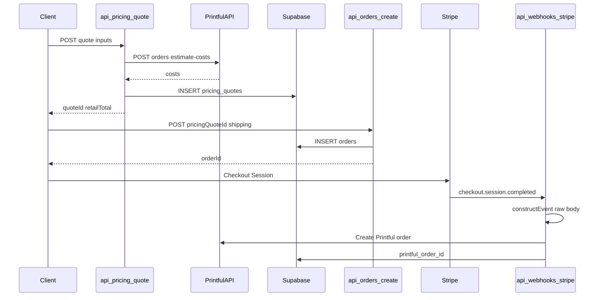
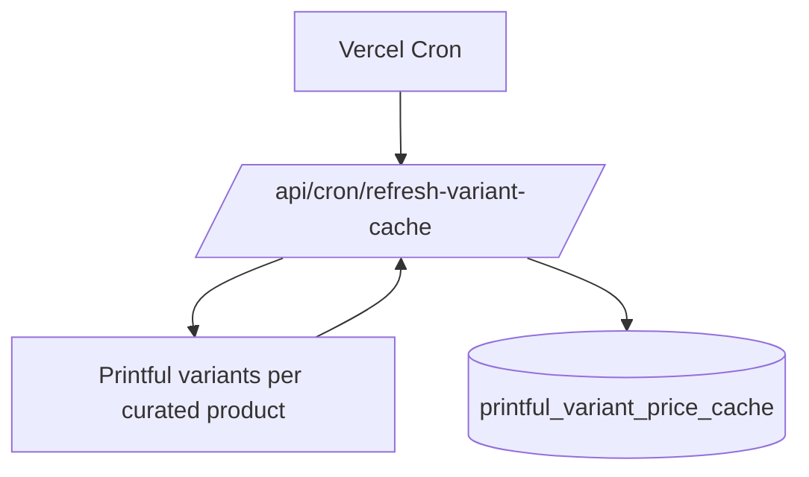

# Printful pricing system

This app can run **Pricing v2**: Printful `estimate-costs` at checkout, server-persisted quotes, server-created orders, and optional **server-side Printful fulfillment** after Stripe payment.

See [Printful_Pricing_GoldenGooseTees.md](../Printful_Pricing_GoldenGooseTees.md) for the full specification.

## Environment flags

| Variable | Where | Purpose |
|----------|--------|---------|
| `PRICING_V2_ENABLED` | Server | Enables `POST /api/pricing/quote` and `POST /api/orders/create` |
| `VITE_PRICING_V2_ENABLED` | Client | Checkout uses quote + server order path |
| `SERVER_FULFILLMENT_ENABLED` | Server | Webhook submits Printful after payment |
| `VITE_SERVER_FULFILLMENT_ENABLED` | Client | Skips client `submitToPrintful` after card flow |
| `CRON_SECRET` | Server | Bearer secret for manual cron hits (optional; Vercel cron sends `x-vercel-cron`) |
| `PRINTFUL_CURATED_PRODUCT_IDS` | Server | Comma-separated catalog product IDs to show in storefront |

## Database

Apply [supabase/migrations/001_pricing_system.sql](../supabase/migrations/001_pricing_system.sql) in the Supabase SQL editor.

## Data flow



## Variant cache cron



## Rollback

1. Unset `PRICING_V2_ENABLED` / `VITE_PRICING_V2_ENABLED` to fall back to legacy client totals and flat shipping estimate.
2. Unset `SERVER_FULFILLMENT_ENABLED` / `VITE_SERVER_FULFILLMENT_ENABLED` to use client Printful submission again (legacy).
3. Keep `pricing_quotes` and `pricing_snapshot` data for audits.

## SKU comparison table

Run (requires `PRINTFUL_API_KEY` and env loaded):

```bash
npx tsx scripts/sku-pricing-table.ts
```
